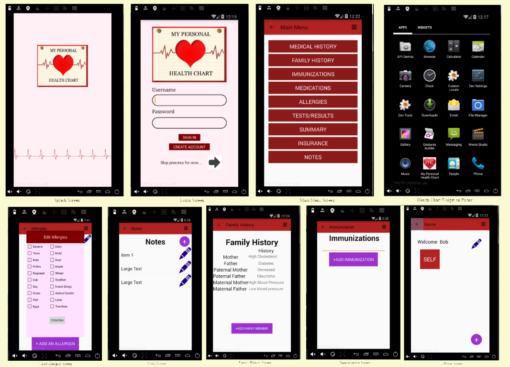

# My Personal Health Chart Android Mobile
Webpage with the My Personal Health Chart Android Mobile Application

## Live App Link:
http://people.brandeis.edu/~maylilyz/Sunny%20Lee%20-%20Bonus/sunnylee-bonus.html

## Technologies Used:
HTML5/CSS3/JavaScript/Android

## Motivation:
This was inspired by my family to create an app that holds personally entered medical information about self and other family members on an Android device.

## Summary:
This site will allow you to download the My Personal Health Chart App, which is an app for Android mobile devices.  This app is for anyone who wants to keep records of health information for their family as well as for themselves.

## Screnshot: 

